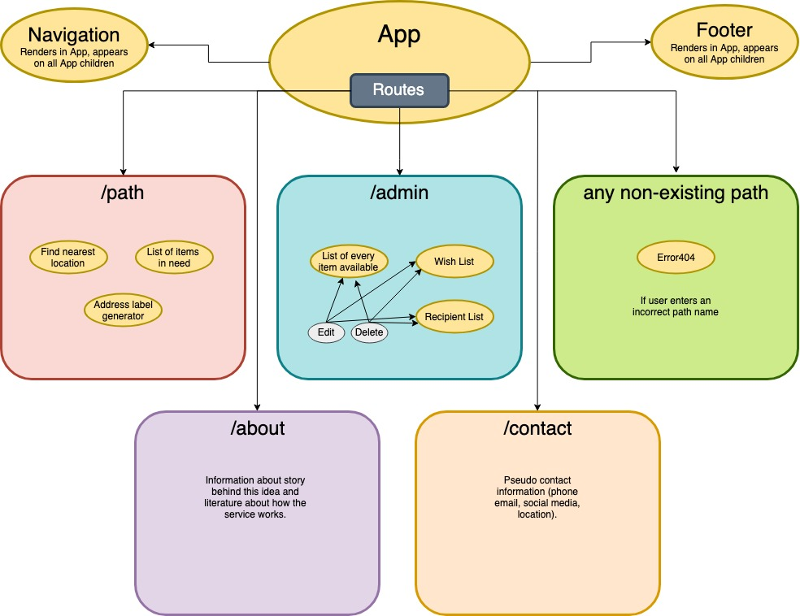
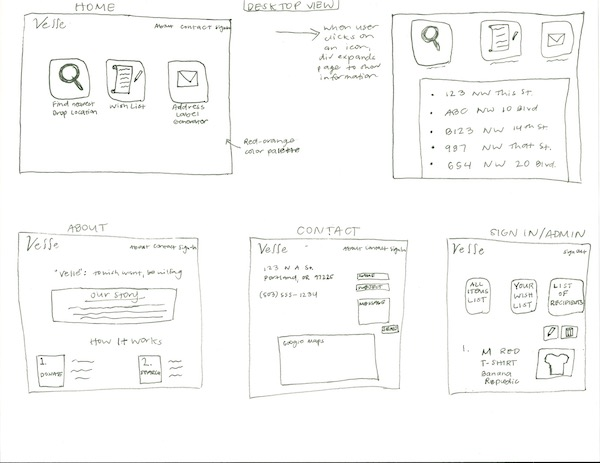
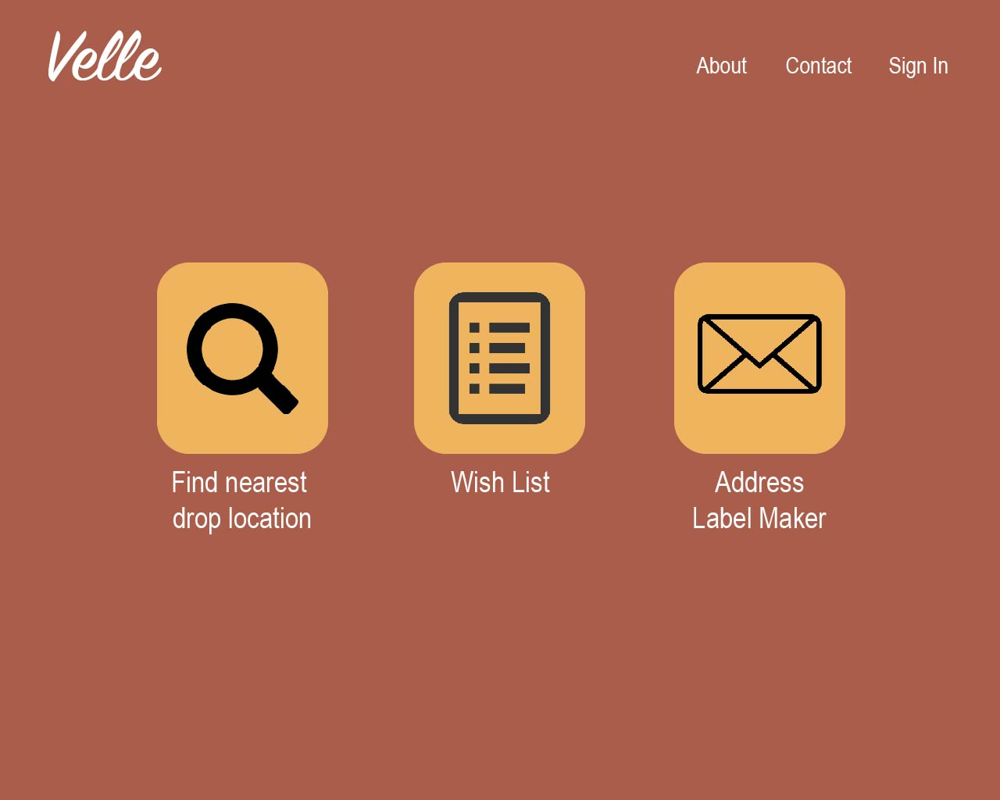
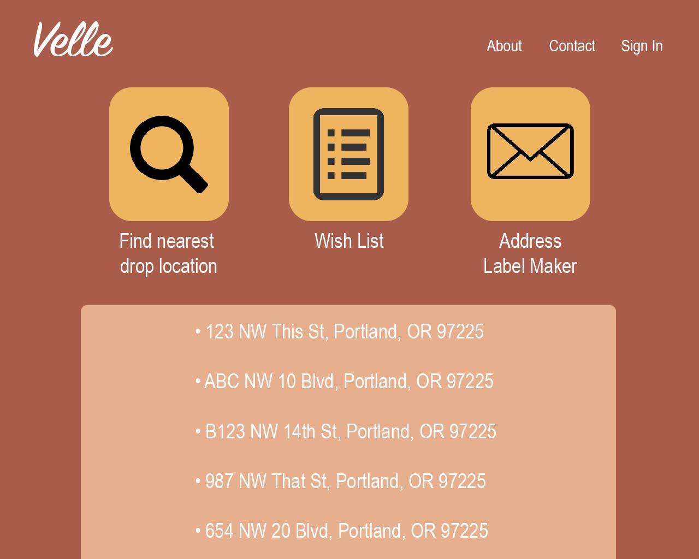
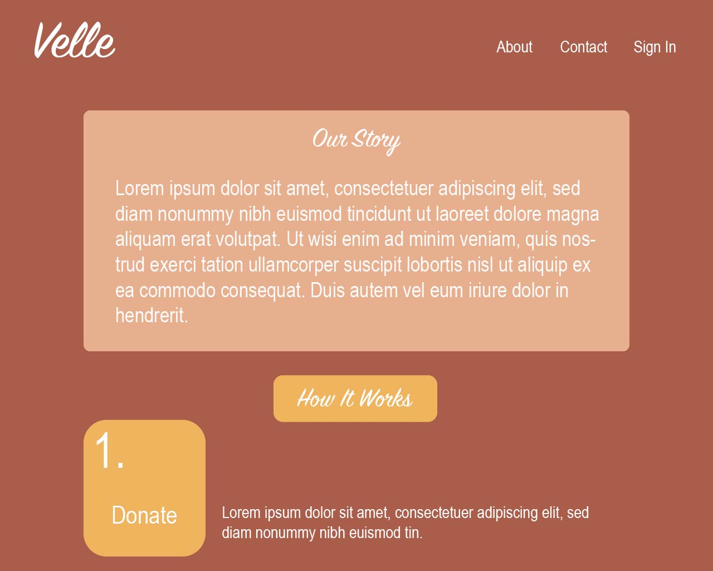

# Velle

#### _Front-End Development, Independent Capstone Project, 5.3.19_

#### By _**Randee Layosa**_


[](https://opensource.org/licenses/MIT)

## Description

This application is an Independent Capstone project, culminating my knowledge and experience gained during my 27 weeks time at [Epicodus](https://www.epicodus.com/) in the Front-End Development track. It demonstrates a knowledge of React.js and an aptitude for planning, designing, and developing a functional application that meets the UX/UI industry standards of today.

_<p align="center">"Velle" - Latin: to wish, want, be willing</p>_

_Velle is a pseudo company/organization that operates as a middle man between various public outreach supporters, and individuals who want to help their fellow neighbors by donating their clothes. Recently, I have found myself in a predicament that I am sure others share as well. Many of us have unwanted or unneeded clothes that are trendy brand named or were bought at a modest but higher price. People may not want to hand these items to a store as they offer extremely low buying prices in return. And, knowing how much they had originally bought these items for, these people may also not want to hand the clothes over to Goodwill for free just to be resold for 100% profit to someone else. I and others, I'm sure, would much rather place our donations in the hands of reputable outreach organizations and programs who will in turn place the items directly in the hands of the individual in need. Velle stands as the organizer, liaison, and middle man that would make an operation like this possible. Benevolence._

## Preview
<p align="center">

</p>

## Technologies Used

  * _React_
  * _Redux_
  * _Webpack_
  * _eslint_
  * _SASS_
  * _JSX_

## Setup/Installation Requirements

#### To open and view this project file:
1. Clone this GitHub repository https://github.com/randeelayosa/velle.git to your Desktop.
  * Install git onto your computer if it isn't already.
  * Open your Terminal, and enter the following commands:
  ```
  cd desktop
  git clone https://github.com/randeelayosa/velle.git
  cd velle
  atom .
  npm install
  npm run start
  ```
  * _You can use another text editor if Atom is not your preferred program._
  * _Make sure a "node_modules" folder is created in your project file. If it hasn't, run `npm install` again._
  * _You can then go to the link in step 1 above, or continue on to the following instructions to run the server._
2. Go to http://localhost:8080/ in the browser of your choice. _Note: The app will automatically reload if you edit any of the code in the source files._


## Planning

  | **Configuration/Dependencies** | **Use** |
| :-------------     | :------------- |
| Babel | JS transpiler |
| CSS-Loader, Style-Loader, Sass-Loader, Node-Sass | styling |
| ESLint | JS linter, checks code for errors |
| File-Loader, URL-Loader | image loader |
| HTML-Webpack-Plugin | loads HTML file |
| Jasmine, Karma | for testing code |
| React | JS Library |
| Webpack | bundles/compiles code |


### Components and Routes Layout

<p align="center">
  
</p>

### Sketches
<p align="center">
  
</p>

### Wireframes
<p align="center">Home</p>
<p align="center">
  
  
</p>
<p align="center">About</p>
<p align="center">
  
</p>

### Prototyping
<p align="center">
  
</p>


### Features Built and To Be Completed
- [ ] Navigation bar.
- [ ] List of support agencies.
- [ ] Login feature to access private information.
- [ ] Agencies can maintain their Wish List.
- [ ] Search feature to find drop off locations nearby.
- [ ] Agencies can upload images and information of items that they received but have not given away and are willing to share/send to other agencies.
- [ ] Sharing feature that allows agencies to view item lists of other agencies to see if they have a specific requested item.
- [ ] Address label generator feature.
- [ ] About Page
- [ ] Contact Page
- [ ] Page routing
- [ ] Styling

### Commit History/Work Activity Log
_Friday, May 3 - Planning_
* 8:00 - Clone down template repo and begin readme
* 9:00 - Start planning out and creating sketches
* 10:00 - Begin wireframing
* 1:00 - Update/change out readme to reflect appropriate information.
* 2:00 - Add component tree image to readme.
* 3:00 - Research more about outreach programs in Portland, and if businesses that offer similar services to my app the exist.
* 4:00 - Done for the day.

_Friday, May 10 - Wireframing and Static Build_
* 8:00 - Wireframing
* 9:00 - Wireframing

### Legal

*This software is licensed under MIT license.*

Copyright (c) 2019 **_Randee Layosa_**
